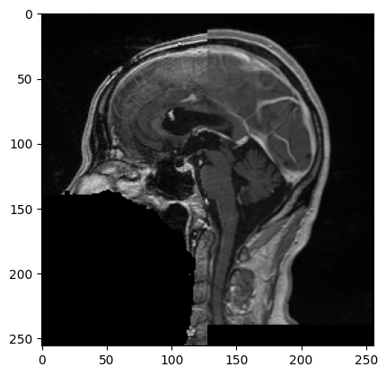
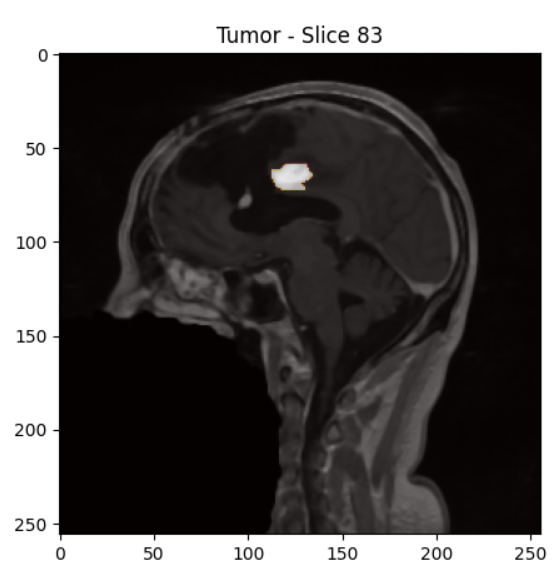

# Description du projet

Ce projet vise à effectuer le suivi des changements d'une tumeur à partir de deux scans effectués sur un même patient à des dates différentes, “étude longitudinale”. Nous utilisons les bibliothèques ITK (Insight Segmentation and Registration Toolkit) et VTK (Visualization Toolkit) pour effectuer le recalage des volumes, la segmentation des tumeurs et la visualisation des changements entre les deux tumeurs.

## Étapes du projet

### Visualisation initiale des scans

- Nous avons commencé par visualiser les scans tranche par tranche en vue axiale. Cela nous a permis d'identifier que les scans nécessitaient une simple translation pour être correctement alignées.

### Recalage des images

- Ensuite nous avons fait une fonction de recalage pour réaligner les deux images en utilisant une transformation de translation et une métrique de similarité.
- Nous avons utilisé un optimiseur de descente de gradient avec des pas réguliers pour affiner le recalage.
- Superposition des deux scan, à gauche le scan 1 à droite le scan2:
  

### Prétraitement des images

- Un prétraitement a été appliqué aux images pour réduire le bruit et améliorer le contraste. Cela a été réalisé en appliquant un filtre de lissage (CurvatureFlowImageFilter) et un filtre de mise à l'échelle de l'intensité (RescaleIntensityImageFilter).

### Identification de la tumeur

- Après le prétraitement, nous avons de nouveau visualisé les scans tranche par tranche pour localiser la tumeur.
- Une fois la position de la tumeur identifiée, nous avons défini un point de départ (seed point) pour la segmentation.

### Segmentation de la tumeur

- Nous avons ensuite utiliser ConnectedThresholdImageFilter pour segmenter la tumeur.
- Les seuils maximal et minimal ont été déterminés manuellement pour segmenter la tumeur.
- Segmentation de la Tumeur :
  

### Calcul des volumes et différences d'intensité

- Nous avons calculé les volumes des tumeurs segmentées en comptant le nombre de voxels non nuls et en multipliant par le volume d'un voxel.
- La différence d'intensité des voxels entre les deux tumeurs a également été calculée pour quantifier les changements.

### Visualisation des tumeurs

- Les tumeurs segmentées ont été visualisées côte à côte en 3D à l'aide de VTK.

### Analyse des Résultats

Les résultats de l'analyse des tumeurs montrent les éléments suivants :

- **Volume de la Tumeur 1** : 2433.0 mm³
- **Volume de la Tumeur 2** : 2866.0 mm³
- **Différence d'Intensité** : 789.0

#### Interprétation

**Augmentation du Volume** : La tumeur a augmenté de près de 17.78% entre les deux scans, ce qui pourrait indiquer une progression de la maladie.

## Difficultés rencontrées

- **Différents seuils minimaux** : Nous avons rencontré des difficultés avec les seuils minimaux qui étaient différents pour chaque scan. Nous avons tenté d'uniformiser ces seuils afin d'obtenir une segmentation cohérente, mais nous n'avons pas réussi à obtenir des résultats satisfaisants. Cette variation a impacté la précision de la segmentation et la comparaison des volumes des tumeurs.

## Contributions
- **Collaborateurs** : [-Jean GUERIN | Jean-Marc TWAGIRAKRISTU]